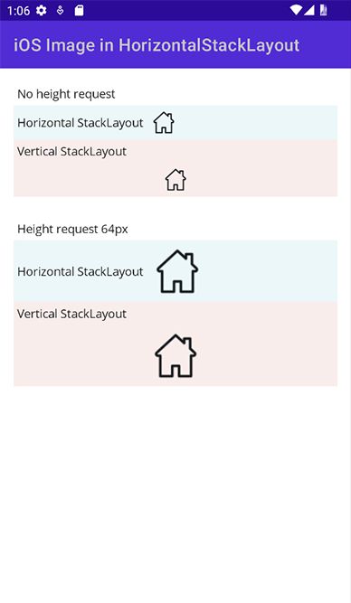
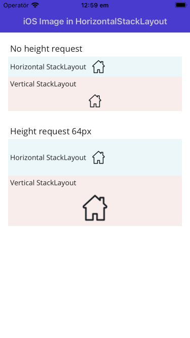

## Title

[iOS] Image.HeightRequest not respected when Image added in an Horizontal StackLayout

## Description

Adding an `Image` in an horizontal `StackLayout` and setting the Image's `HeightRequest` to
something different than the underlying image Height is rendered differently on iOS and Android. 

On iOS, Image in an horizontal StackLayout does not respect HeightRequest and always shows
the image with its original size.

On Android, the Image is scaled correctly with regard to the HeightRequest property. 

This is not an issue when using vertical `StackLayout` or `Grid`. 

## Github issues

* dotnet/maui#12879

## Steps to Reproduce

* Create a `StackLayout` with Horizontal orientation
* Add an `Image` children to the StackLayout and set its `HeightRequest` to something else
than its original height. 

OR

Run the attached sample on iOS and Android and compare the rendered views. (See screenshots below)

 

## Version with bug
7.0.102 (current)

## Last version that worked well
Unknown

## Affected platforms
iOS

## Affected platform versions
iOS 16.2

## Did you find any workaround?
Avoid wrapping Images in horizontal StackLayouts

## Relevant log output
No response